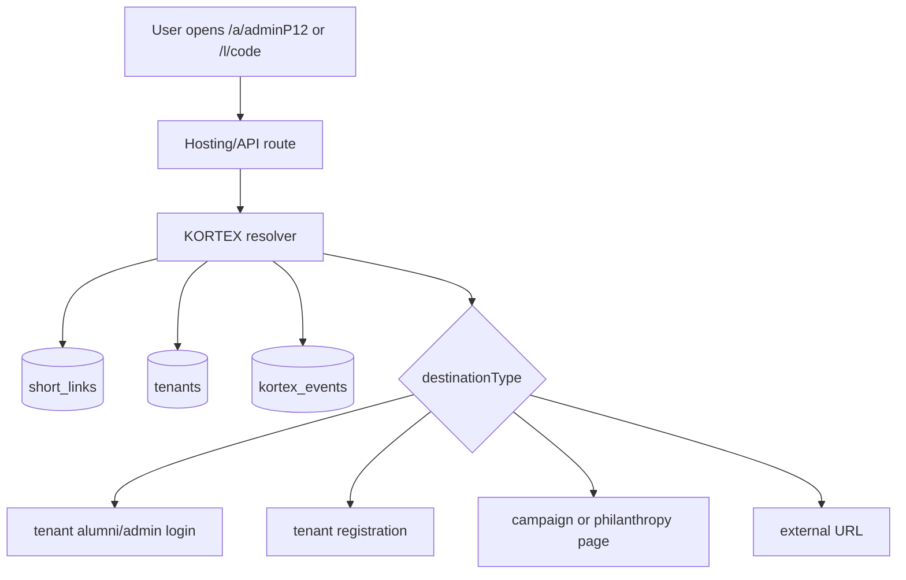

# KORTEX API Module

KORTEX is the canonical smart-link, tenant-link, campaign-link, and redirect module.

Canonical product architecture lives in the frontend repo at:

```text
kaayko/docs/products/KORTEX_TENANT_ARCHITECTURE_PLAN.md
```

## Runtime Mounts

Mounted from `functions/index.js`:

```js
apiApp.use("/kortex", kortexRouter);
apiApp.use("/smartlinks", kortexRouter);
apiApp.use("/campaigns", require("./api/campaigns/campaignRoutes"));
apiApp.use("/", require("./api/campaigns/campaignPublicResolver"));
apiApp.use("/", require("./api/deepLinks/deeplinkRoutes"));
```

Rules:

- `/kortex` is canonical.
- `/smartlinks` is compatibility only.
- `/campaigns` remains mounted separately for management compatibility.
- `/:campaignSlug/:code` remains public campaign namespace routing.
- `/l/:id` remains universal short link routing.

## Key Files

| File | Purpose |
| --- | --- |
| `smartLinks.js` | Main Express router for `/kortex` and `/smartlinks` |
| `v2LinkIntents.js` | Tenant alias links, destination types, event ledger, tenant bootstrap, tenant analytics |
| `smartLinkService.js` | Short-link CRUD and Firestore writes to `short_links` |
| `redirectHandler.js` | Device-aware and V2 intent-aware redirects |
| `tenantContext.js` | Authenticated tenant context and access checks |
| `clickTracking.js` | Detailed click analytics |
| `webhookService.js` | Webhook event delivery |
| `attributionService.js` | Click-to-install attribution helpers |

## Canonical Endpoints

```text
GET    /kortex/health
GET    /kortex/tenants/resolve
GET    /kortex/tenants/:tenantSlug/bootstrap
GET    /kortex/links/:code/resolve
POST   /kortex/events
POST   /kortex/tenant-links
GET    /kortex/tenants/:tenantId/analytics
POST   /kortex/tenant-registration
GET    /kortex/stats
GET    /kortex/r/:code
POST   /kortex
GET    /kortex
GET    /kortex/:code
PUT    /kortex/:code
DELETE /kortex/:code
POST   /kortex/events/:type
```

Compatibility:

```text
/smartlinks/* -> same router as /kortex/*
```

## Link Intent Fields

KORTEX V2 links may include:

```js
{
  tenantId,
  campaignId,
  destinationType,
  requiresAuth,
  audience,
  source,
  intent,
  returnTo,
  conversionGoal
}
```

Supported destination types:

- `tenant_admin_login`
- `tenant_alumni_login`
- `tenant_registration`
- `tenant_public_page`
- `tenant_dashboard`
- `campaign_landing`
- `campaign_member_view`
- `philanthropy_campaign`
- `donation_checkout`
- `campaign_report`
- `external_url`

## Collections

Primary collections:

- `short_links`
- `campaigns`
- `campaign_links`
- `kortex_events`
- `link_analytics`
- `click_events`
- `tenants`
- `admin_users`
- `pending_tenant_registrations`
- `subscriptions`

## Public Flow



## Test Coverage

Run from `kaayko-api/functions`:

```bash
npm run test:kortex -- --runInBand --forceExit
```

Current KORTEX tests cover:

- CRUD and tenant scoping
- source-aware redirects
- campaign links and public campaign resolver
- tenant bootstrap
- namespace alias resolution
- V2 event tracking
- tenant alias creation
